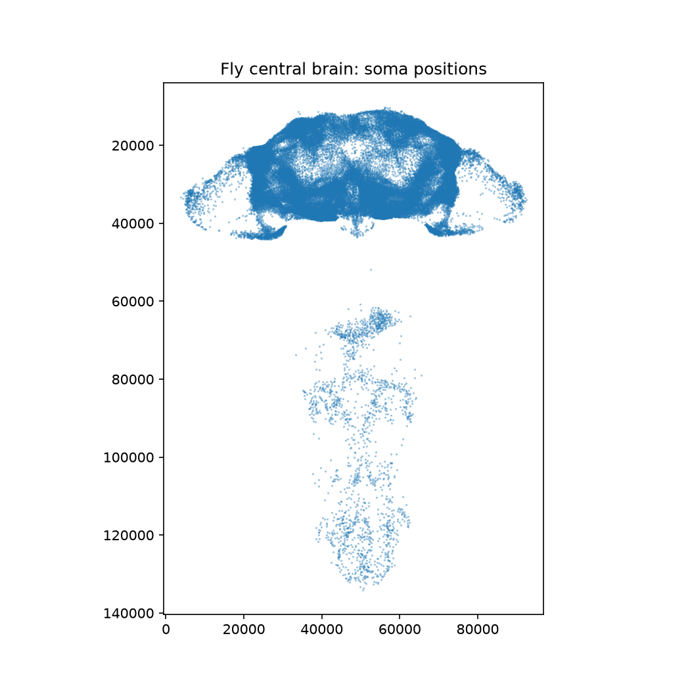

# FlySyntax

FlySyntax is an experimental study of whether a recurrent network with the wiring of a
fruit-fly central brain can distinguish syntactically valid C snippets from snippets
with syntax errors. The connectome supplies a fixed, sparse recurrent topology; training
learns token embeddings, per-neuron dynamics, and a small classifier.

This is a research prototype, not a C compiler or a general-purpose code checker. The
included tasks use generated examples and GCC as the syntax-validity reference.

## Connectome overview

The image shows soma locations in the central-brain connectome used by the experiments.



The repository also includes [an offline activity viewer](runs/viz/real.html) and its
[shuffled-connectome comparison](runs/viz/shuffled.html). Open either HTML file in a
browser to explore the precomputed examples.

## How it works

The model reads a token sequence by injecting each token embedding into designated input
neurons. Activity then propagates through the sparse connectome over recurrent steps.
The graph and synapse weights remain fixed; the model learns a gain, bias, and leak for
each neuron, followed by a readout over descending neurons.

Two generated datasets are included:

- **C syntax:** generated valid functions and mutated examples, labeled using GCC.
- **Paired syntax (v2):** valid and invalid twins with matching token counts, designed
  to make token-frequency shortcuts less useful. GCC provides the validity labels.

Training and evaluation scripts compare the connectome model with sequence and
frequency-based baselines. The `runs/` directory contains saved experiment outputs and
precomputed visualizations.

## Repository contents

| Path | Description |
| --- | --- |
| `src/flysyntax/model.py` | Connectome loading and recurrent classifier |
| `scripts/` | Dataset generation, tokenization, training, evaluation, and visualization |
| `data/processed/` | Prepared syntax examples, token arrays, and vocabularies |
| `data/raw/fly-connectome-49k/` | Connectome graph and neuron metadata |
| `runs/` | Experiment logs, checkpoints, and viewer outputs |
| `reference/doomfly-rl/` | Reference materials retained with their original license |

## Setup

Python 3.10 or newer is recommended. Training and model inspection require PyTorch,
NumPy, and SciPy. Dataset download also uses Hugging Face Hub; plotting and dataset
generation use Matplotlib and tqdm.

Create an environment and install the dependencies:

```bash
python -m venv .venv
```

On Windows:

```powershell
.venv\Scripts\Activate.ps1
```

On macOS or Linux:

```bash
source .venv/bin/activate
```

Then install the requirements:

```bash
python -m pip install -r requirements.txt
```

The processed syntax datasets are included. The raw connectome files are included too;
to download a fresh copy instead, run:

```bash
python scripts/01_download.py
```

The model uses the full connectome by default. Training time depends on the machine and
the selected graph size. For a smaller run, pass a positive neuron count with
`--subgraph`.

## Run an experiment

Train the model on the paired v2 dataset using the real connectome:

```bash
python scripts/06_train.py --data v2 --mode real --epochs 8 --out runs/v2_real
```

To use the shuffled-wiring control, set `--mode shuffled`. Training writes a checkpoint
and a validation log to the selected output directory.

Run a baseline, for example the GRU:

```bash
python scripts/08_baselines.py --data v2 --model gru
```

The baseline script also supports `bow` and `bigram` models. Use
`python scripts/06_train.py --help` and `python scripts/08_baselines.py --help` to see
the available options.

## Regenerate the datasets

Dataset generation uses GCC (`gcc -fsyntax-only`) to determine whether each example
compiles. Install GCC and ensure `gcc` is on `PATH` before running these commands.

Generate the paired dataset:

```bash
python scripts/10_make_dataset_v2.py
```

Generate and tokenize the original C syntax dataset:

```bash
python scripts/03_make_dataset.py
python scripts/04_tokenize.py
```

These commands write generated data under `data/processed/`.

## Data and attribution

The connectome is the Fly Connectome 49k dataset, derived from MaleCNS v1.0 central-brain
data and distributed under CC BY 4.0. See
[`data/raw/fly-connectome-49k/README.md`](data/raw/fly-connectome-49k/README.md) for
dataset provenance, attribution, and details of the graph representation.

Project code in this repository is covered by the included Apache License 2.0.
Materials under `reference/doomfly-rl/` retain their own license and attribution notices.

## Scope and limitations

The task is deliberately narrow: it tests syntax validity on generated C snippets, not
program behavior, style, security, or correctness on arbitrary source code. A shuffled
connectome is included as a control; results should be interpreted as experiments on this
task, not evidence that biological fly wiring is uniquely suited to code analysis.
